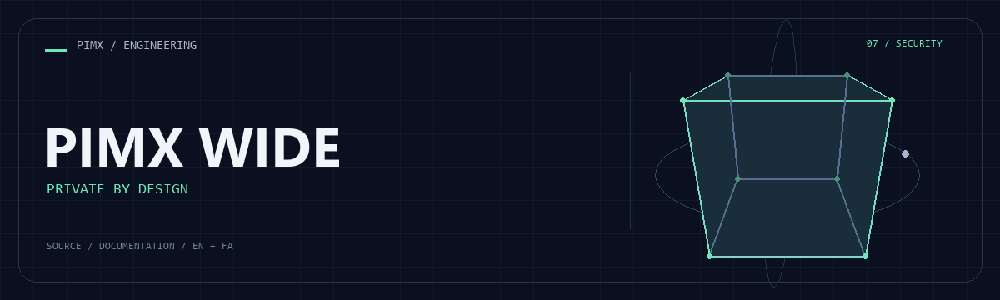

<div align="center">



**[English](README.md) · [فارسی](README.fa.md)**

</div>

<div dir="rtl">

# 🔐 PIMX WIDE

رابط چندزبانه رمزنگاری متن و فایل با Web Crypto مرورگر، AES-256-GCM و کلید مشتق‌شده از گذرواژه، همراه سوابق محلی و ثبت اختیاری بازدید.

[GitHub](https://github.com/MOHAMMADREZAABEDINPOOR/PIMX_WIDE) · [PIMX / Profile](https://github.com/MOHAMMADREZAABEDINPOOR) · [بنر ثابت](assets/readme/hero.png)

| نمای کلی | جزئیات |
|:---|:---|
| 🔐 تجربه | برنامه وب / تجربه مرورگری |
| 🧰 فناوری | `React` · `Vite` · `TypeScript` |
| 🌐 زبان راهنما | [English](README.md) · [فارسی](README.fa.md) |

[✨ امکانات](#امکانات) · [🚀 شروع کار](#شروع-کار) · [⚙️ تنظیمات](#تنظیمات) · [🌍 استقرار](#استقرار)

---

<a id="امکانات"></a>

## ✨ امکانات

| بخش | قابلیت موجود |
|:---|:---|
| 🔐 حفاظت | رمزنگاری و بازیابی احرازشده با AES-256-GCM |
| 🔐 حفاظت | مشتق‌سازی از گذرواژه با PBKDF2-SHA-256 و ۱۰۰٬۰۰۰ دور |
| 🌐 تجربه کاربری | مسیریابی چندزبانه، صفحات حریم خصوصی و راست‌به‌چپ |
| 🌐 تجربه کاربری | ابزار ذخیره محلی و مسیرهای آمار بازدید Cloudflare |

<a id="پشته-فنی"></a>

## 🧰 پشته فنی

| ابزار | نسخه یا منبع |
|---|---|
| React | `18.2.0` |
| Vite | `^6.2.0` |
| TypeScript | `~5.8.2` |

<a id="شروع-کار"></a>

## 🚀 شروع کار

Node.js 22.12 یا بالاتر و مدیر پکیج مشخص‌شده در package.json. نسخه وابستگی‌ها را مطابق فایل قفل نصب کنید.

<div dir="ltr">

```bash
git clone https://github.com/MOHAMMADREZAABEDINPOOR/PIMX_WIDE.git
cd PIMX_WIDE

npm ci
npm run dev
```

</div>

<a id="تنظیمات"></a>

## ⚙️ تنظیمات

کلیدهای زیر از فایل نمونه یا کد استخراج شده‌اند؛ همه الزاماً اجباری نیستند. مقدار و پیش‌فرض را در همان فایل بررسی و اسرار را فقط در محیط محلی یا هاست تنظیم کنید.

| نام | کاربرد |
|---|---|
| `API_KEY` | اعتبارنامه یا اتصال؛ خصوصی نگه دارید |
| `GEMINI_API_KEY` | اعتبارنامه یا اتصال؛ خصوصی نگه دارید |

اتصال‌های میزبانی: `PIMX_VISITS`.

<a id="استفاده"></a>

## 🎯 استفاده

بخش رمزکردن را انتخاب و ورودی و گذرواژه را وارد کنید؛ خروجی رمز‌شده را نگه دارید. برای بازیابی همان گذرواژه را در بخش رمزگشایی وارد کنید.

<a id="ساختار-پروژه"></a>

## 🗂️ ساختار پروژه

| مسیر | نقش |
|---|---|
| [`assets/`](assets/) | فایل برند، رسانه و README |
| [`components/`](components/) | اجزای قابل استفاده مجدد رابط |
| [`functions/`](functions/) | توابع API میزبانی |
| [`public/`](public/) | فایل عمومی وب |
| [`services/`](services/) | سرویس و ابزار اتصال |
| [`index.html`](index.html) | فایل ورودی یا تنظیم پروژه |
| [`metadata.json`](metadata.json) | فایل ورودی یا تنظیم پروژه |
| [`package.json`](package.json) | فایل ورودی یا تنظیم پروژه |
| [`tsconfig.json`](tsconfig.json) | فایل ورودی یا تنظیم پروژه |
| [`wrangler.toml`](wrangler.toml) | فایل ورودی یا تنظیم پروژه |

<a id="فرمان‌ها-و-بررسی"></a>

## 🧪 فرمان‌ها و بررسی

| فرمان | کاربرد |
|:---|:---|
| `npm run dev` | 🧑‍💻 سرور توسعه |
| `npm run build` | 📦 ساخت نسخه انتشار |
| `npm run preview` | 👀 پیش‌نمایش خروجی |

<div dir="ltr">

```bash
npm run dev
npm run build
npm run preview
```

</div>

این‌ها فرمان‌های موجود در package.json هستند؛ فهرست بالا گزارش اجرای آزمون نیست. فرمان تست ممکن است مرورگر، سرویس یا دیتابیس آماده بخواهد.

<a id="استقرار"></a>

## 🌍 استقرار

خروجی build را مطابق معماری منتشر کنید: پروژه دارای server به فرایند Node نیاز دارد؛ رابط Vite استاتیک می‌تواند از dist میزبانی شود. توابع Pages، KV یا D1 به تنظیم مستقل نیاز دارند.

<a id="محدودیت‌ها"></a>

## 📌 محدودیت‌ها

برنامه نمی‌تواند گذرواژه فراموش‌شده را بازیابی کند. نسخه پشتیبان نگه دارید و پیش از حذف اصل داده، بازیابی را امتحان کنید. پردازش مرورگر و آمار بازدید دو رفتار جدا هستند؛ ممیزی مستقل انجام نشده است.

<a id="رفع-مشکل"></a>

## 🛠️ رفع مشکل

- پکیج غایب: وابستگی را با مدیر پکیج پروژه نصب کنید.
- خطای API یا شبکه: آدرس، سرویس و اتصال میزبانی را بررسی کنید.
- فایل قدیمی: در صورت وجود اسکریپت ساخت، build و کش مرورگر را تازه کنید.

<a id="مشارکت"></a>

## 🤝 مشارکت

برای تغییر، شاخه مستقل بسازید، رفتار فعلی را بررسی کنید و توضیح روشن همراه تغییر بفرستید. اطلاعات خصوصی، خروجی build و دیتابیس محلی را commit نکنید.

<a id="مجوز"></a>

## 📄 مجوز

فایل مجوز در این نسخه موجود نیست. نمایش عمومی کد به‌تنهایی مجوز استفاده مجدد نیست؛ برای شرایط استفاده با مالک مخزن هماهنگ کنید.

---

ساخته‌شده در مجموعه **PIMX** · مستندات فارسی و انگلیسی.

---

<div align="center">

🔐 **PIMX WIDE** · [English](README.md) · [فارسی](README.fa.md)

</div>

</div>
